# Keymaps

Visual reference for all keymap layers.

## Layer 0: Numbers and Symbols

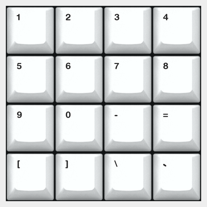

## Layer 1: Letters A-P

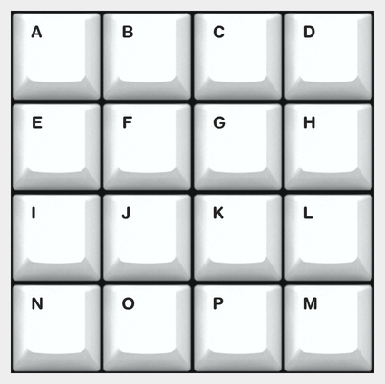

## Layer 2: Letters Q-Z

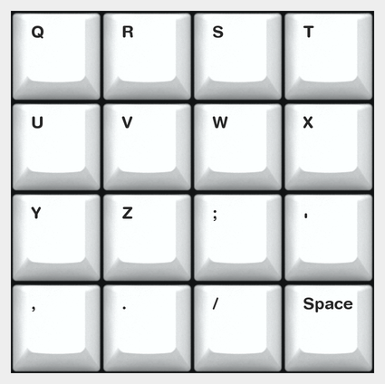

## Layer 3: Function Keys

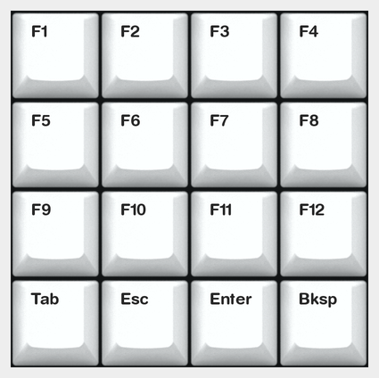

## Layer 4: Phrases

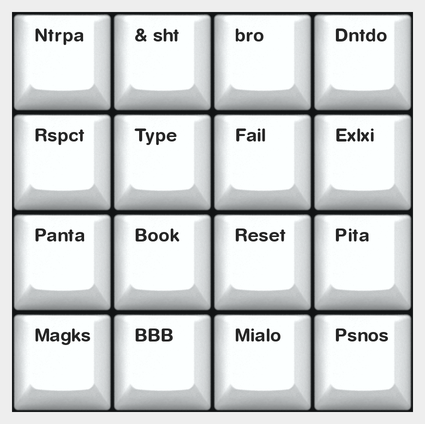

## Layer 5: Media Controls

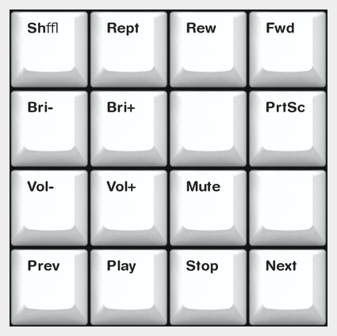

## Layer 6: Mouse

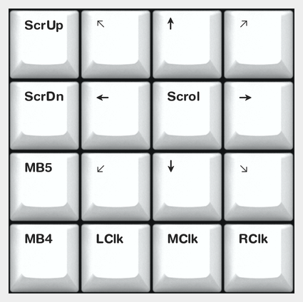

## Layer 7: Gaming

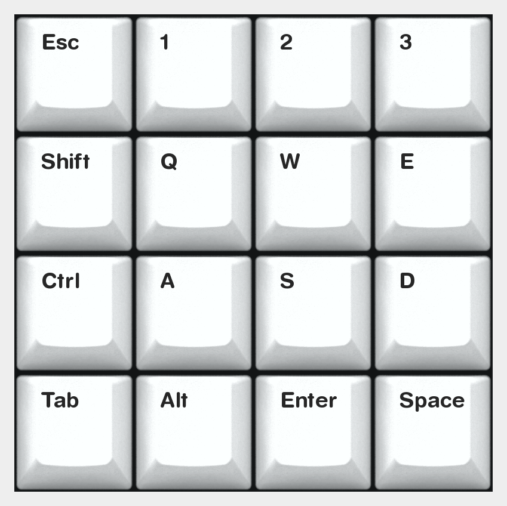

## Layer 8: Numpad

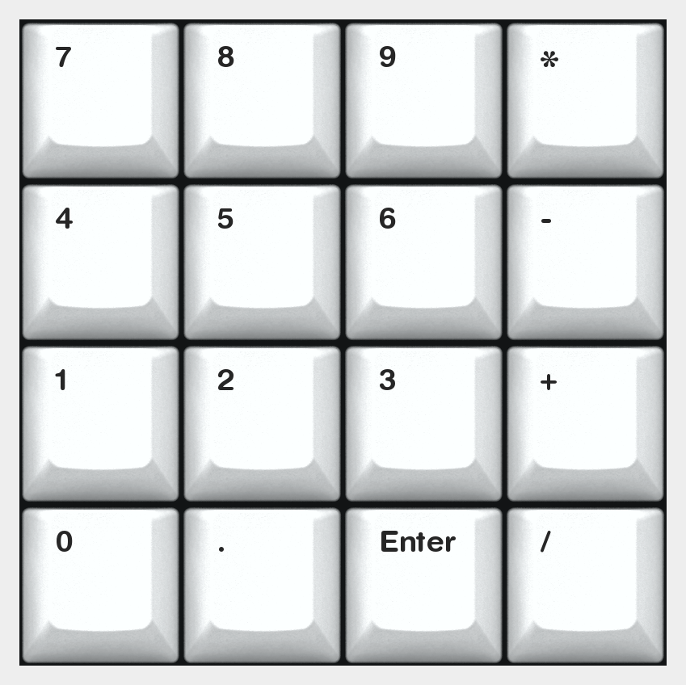

## Layer 9: QWERTY

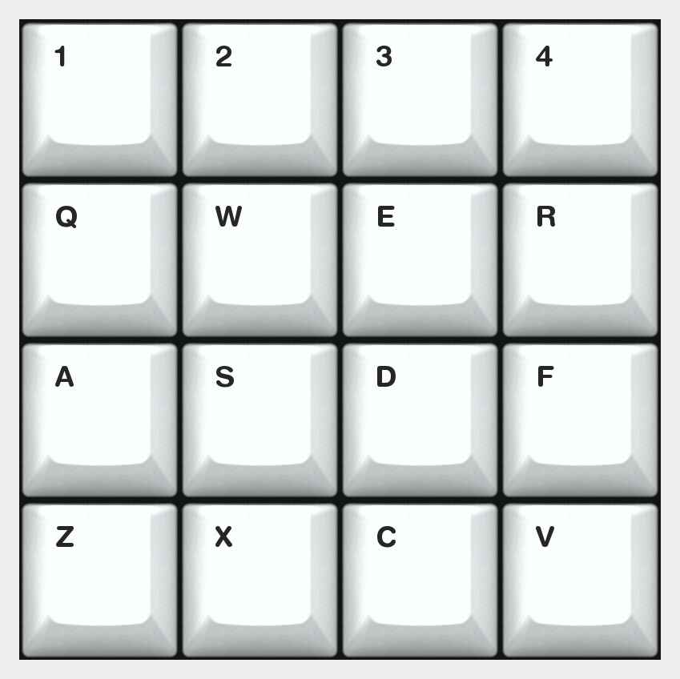

## Layer 10: OnShape Sketch Tools

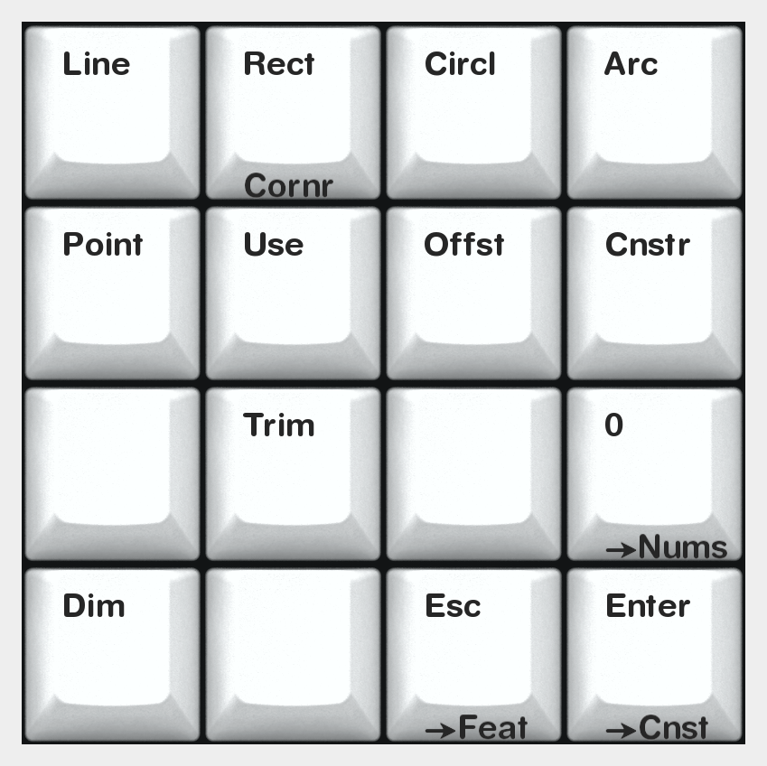

## Layer 11: Placeholder

## Layer 12: Placeholder

## Layer 13: Placeholder

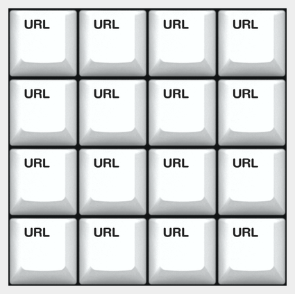

## Layer 14: Placeholder

## Layer 15: Bluetooth

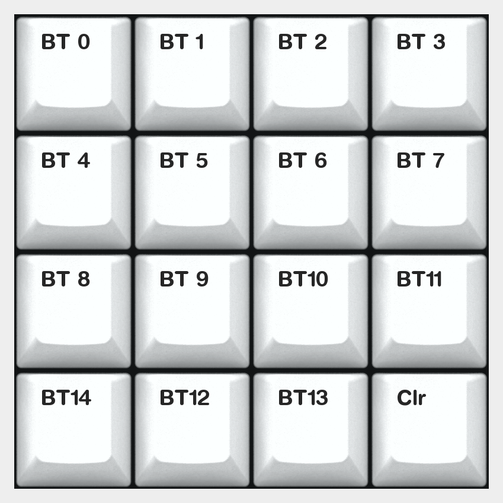

## Layer 16: Layer Select

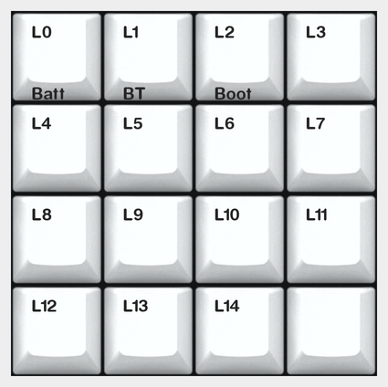

## Layer 17: Scroll

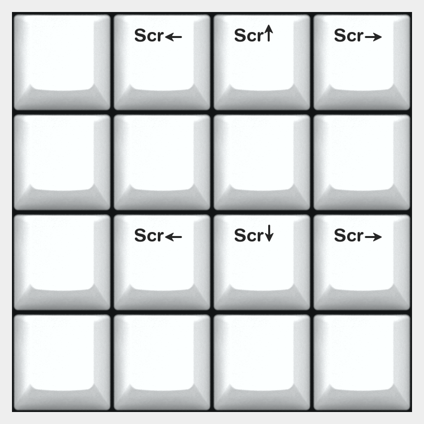

## Layer 18: OnShape Constraints

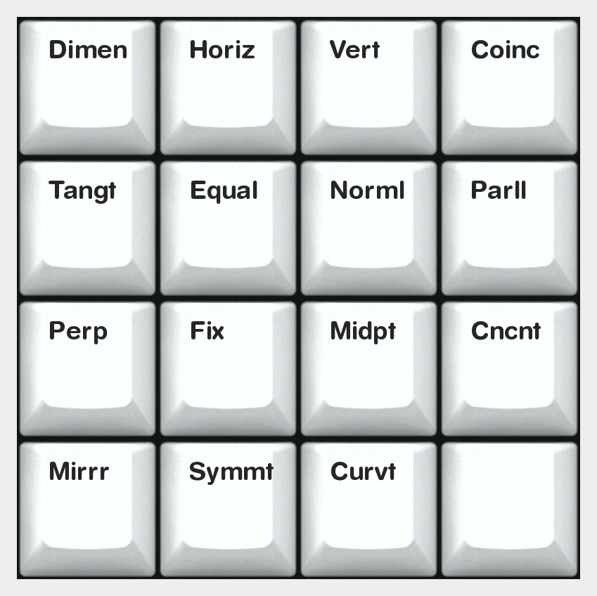

## Layer 19: OnShape Features

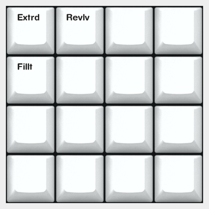

## Layer 20: OnShape Numbers

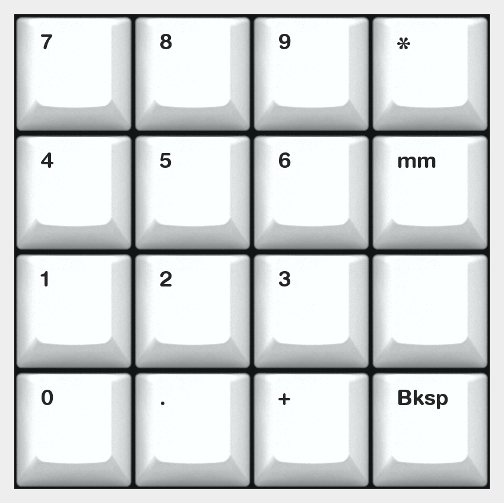
